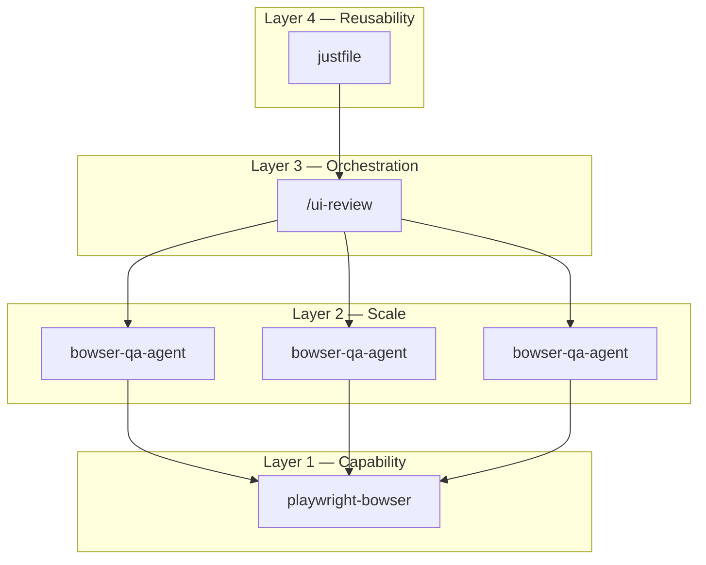

# B_owser

> Agentic browser automation and ui testing system — built with composable skills, subagent, command, and justfile layered architecture for repeatable, deployable browser use. Watch the [breakdown video](https://youtu.be/efctPj6bjCY) to see how Bowser works.

<p align="center">
  
</p>

## The Four-Layer Stack

<p align="center">
  
</p>

Every Bowser workflow is built from four composable layers — each one does one job and delegates down.

| Layer | Name         | Role                                                                | Where it lives      |
| ----- | ------------ | ------------------------------------------------------------------- | ------------------- |
| **4** | **Just**     | Reusability — one command to run everything                         | `justfile`          |
| **3** | **Command**  | Orchestration — discover stories, fan out agents, collect results   | `.claude/commands/` |
| **2** | **Subagent** | Scale — parallel execution, isolated sessions, structured reporting | `.claude/agents/`   |
| **1** | **Skill**    | Capability — drive the browser via CLI or Chrome MCP                | `.claude/skills/`   |

**Skills** give your agent raw capability. **Subagents** let you scale that capability into parallel, isolated workers. **Commands** orchestrate those workers into repeatable workflows. **Justfile recipes** make everything callable with a single terminal command — by you, your team, or other agents.

The key insight: you can enter at any layer. Test a skill directly, spawn a single agent, run a full orchestration command, or fire a one-liner from your justfile. Each layer is independently testable, and they compose upward.

## What is this?

### Problem
No consistent agentic tooling for running browser automation and UI testing across tools and applications — agents need both observable (your browser) and headless (background) modes, configurable per-run settings, and true validation workflows with full user-level tooling.

### Solution
A composable, dual-purpose system — a skill drives the browser, a subagent wraps it for parallel execution, and a slash command orchestrates stories at scale. Test the skill standalone, spawn one agent for a single story, or fan out across dozens in parallel. The key here is being able to take a slightly opinionated approach and tweak it for a variety of browser automation and ui testing use cases.

## Install

### Claude Code

Bowser runs inside [Claude Code](https://code.claude.com/docs/en/overview). Install it with any of these methods:

```bash
# Native install (recommended — auto-updates)
curl -fsSL https://claude.ai/install.sh | bash

# Homebrew
brew install --cask claude-code
```

Then start Claude Code in this project:

```bash
cd bowser
claude
```

### Playwright CLI

The Playwright Bowser skill requires [`playwright-cli`](https://github.com/microsoft/playwright-cli) — a token-efficient CLI for Playwright:

```bash
npm install -g @playwright/cli@latest
```

Verify the install:

```bash
playwright-cli --help
```

### Just (optional)

The [`justfile`](justfile) provides one-command recipes for every layer. Install [`just`](https://github.com/casey/just):

```bash
brew install just
```

## Quick Use

All commands are defined in the [`justfile`](justfile). Run `just` to see what's available.

```bash
# ─── Layer 1: Skill (Capability) ─────────────────────────────
just test-playwright-skill                    # Playwright skill direct (headed)
just test-chrome-skill                        # Chrome skill direct (requires --chrome)

# ─── Layer 2: Subagent (Scale) ───────────────────────────────
just test-playwright-agent                    # Playwright subagent (isolated session)
just test-chrome-agent                        # Chrome subagent (requires --chrome)
just test-qa                                  # QA agent — structured story validation

# ─── Layer 3: Command (Orchestration) ────────────────────────
just hop amazon-add-to-cart "earbuds"         # Run a saved workflow via hop-automate
just ui-review                                # Parallel QA across all YAML stories

# ─── Layer 4: Just (Reusability) ─────────────────────────────
just automate-amazon                          # Amazon add-to-cart, multiple items
just summarize-blog                           # Summarize a blog's latest post
```

Every recipe is parameterized — run `just --list` for defaults, or override inline: `just test-qa headed="false"`.

## Architecture

Bowser is a **four-layer system** — each layer has one job and delegates down.

```
┌──────────────────────────────────────────────────────────────────┐
│  REUSABILITY                                                     │
│  just ui-review headed=true vision                               │
│                                                                  │
│  ┌────────────────────────────────────────────────────────────┐  │
│  │  ORCHESTRATE                          /ui-review command   │  │
│  │  Discover YAML stories, fan out agents, aggregate results  │  │
│  │                                                            │  │
│  │  ┌──────────┐  ┌──────────┐  ┌──────────┐                 │  │
│  │  │  Agent 1 │  │  Agent 2 │  │  Agent 3 │  ...            │  │
│  │  │  Story A │  │  Story B │  │  Story C │                 │  │
│  │  └────┬─────┘  └────┬─────┘  └────┬─────┘                 │  │
│  │       │              │              │                      │  │
│  │  ┌────▼──────────────▼──────────────▼───────────────────┐  │  │
│  │  │  SCALE                          bowser-qa-agent      │  │  │
│  │  │  Parse story → execute steps → screenshot → report   │  │  │
│  │  │                                                      │  │  │
│  │  │  ┌────────────────────────────────────────────────┐  │  │  │
│  │  │  │  CAPABILITY               playwright-bowser    │  │  │  │
│  │  │  │  playwright-cli open, snapshot, click, fill,   │  │  │  │
│  │  │  │  screenshot, close                             │  │  │  │
│  │  │  └────────────────────────────────────────────────┘  │  │  │
│  │  └──────────────────────────────────────────────────────┘  │  │
│  └────────────────────────────────────────────────────────────┘  │
└──────────────────────────────────────────────────────────────────┘

Layer 4 — REUSABILITY   justfile recipe          One command to run everything
Layer 3 — ORCHESTRATE   /ui-review command       Discover stories, spawn team, collect results
Layer 2 — SCALE         bowser-qa-agent          Execute one story, step-by-step with screenshots
Layer 1 — CAPABILITY    playwright-bowser skill  Drive the browser via playwright-cli
```



**Why this pattern?**

- **Each layer is testable in isolation.** Run `/playwright-bowser` to test the skill, spawn a single `bowser-qa-agent` to test one story, or run `/ui-review` to test the full pipeline.
- **Stories are just YAML.** Drop a new `.yaml` file in `ai_review/user_stories/` and it's automatically discovered on the next run.
- **Agents are thin wrappers.** Their only job: execute the skill, report results. ~20 lines of config.
- **Parallel by default.** The orchestrator spawns one agent per story — they run simultaneously in isolated browser sessions.
- **Token-efficient.** Agents navigate via accessibility tree, not vision. Screenshots save to disk for human review. Vision mode is opt-in.

## Comparing the Two Approaches

Two browser automation skills built for fundamentally different jobs.

|                         | Claude-Bowser                                  | Playwright-Bowser                        |
| ----------------------- | ---------------------------------------------- | ---------------------------------------- |
| **Built for**           | Personal workflow automation                   | UI testing at scale                      |
| **Browser**             | Your real Chrome (observable)                  | Headless Chromium (isolated)             |
| **Skill**               | `/claude-bowser`                               | `/playwright-bowser`                     |
| **Subagent**            | `claude-bowser-agent`                          | `playwright-bowser-agent`                |
| **Parallel instances**  | No — single shared instance                    | Yes (named sessions)                     |
| **Auth / cookies**      | Uses your existing Chrome profile              | Persistent per session (`--persistent`)  |
| **Startup requirement** | `claude --chrome`                              | Standard Claude Code                     |
| **Token efficiency**    | Lower (MCP tool schemas + accessibility trees) | Higher (CLI-based, minimal context)      |
| **Vision mode**         | Yes                                            | Yes (`PLAYWRIGHT_MCP_CAPS=vision`)       |
| **Headed option**       | Always headed                                  | Headless default, `--headed` available   |
| **Best for**            | Personal automation, existing sessions         | Scale, CI, testing, ground-up automation |

### Claude Bowser — Personal Workflow Automation

Use when **you need your identity** — your logins, cookies, extensions, and browser state.

```bash
# Requires: claude --chrome
/claude-bowser check my order status on amazon.com
```

**Good fit:**
- Automating tasks on sites you're already logged into (Gmail, Jira, internal tools)
- One-off personal workflows (fill out a form, grab data from a dashboard)
- Demos where you want to watch the browser in real-time
- Tasks that depend on browser extensions (password managers, ad blockers, etc.)

**Examples:** "Add this item to my Amazon cart" / "Check my open PRs on GitHub" / "Fill out my weekly status report on Confluence"

| Pros                                                        | Cons                                                       |
| ----------------------------------------------------------- | ---------------------------------------------------------- |
| Zero setup for authenticated sites — uses your real session | Single instance only — no parallel runs                    |
| Observable — watch exactly what's happening                 | Requires `--chrome` flag at startup                        |
| Access to your extensions and full browser profile          | Not CI-friendly (needs a visible Chrome window)            |
| Feels natural — it's your actual browser                    | Lower token efficiency (MCP tool schemas are verbose)      |
| Great for ad-hoc personal tasks                             | Shares your browser — can interfere with your own browsing |
|                                                             | Not available in programmatic (`-p`) mode                  |

### Playwright Bowser — UI Testing at Scale

Use when **you need isolation, repeatability, and parallelism**.

```bash
# Use the skill directly
/playwright-bowser scrape pricing from example.com

# Or spawn as a subagent
# Task tool → subagent_type: playwright-bowser-agent
```

**Good fit:**
- Validating UI behavior across multiple user stories simultaneously
- CI/CD-friendly test runs (headless, no human browser required)
- Testing login flows from scratch (no pre-existing session to leak state)
- Fan-out QA — run 5+ stories in parallel via `bowser-qa-agent`
- Capturing screenshots/PDFs at every step for audit trails

**Examples:** "Validate these 10 user stories against staging" / "Test the checkout flow end-to-end" / "Run regression tests on the new deploy"

| Pros                                                                  | Cons                                                     |
| --------------------------------------------------------------------- | -------------------------------------------------------- |
| Parallel sessions via named instances (`-s=<name>`)                   | No access to your real browser profile or extensions     |
| Token-efficient CLI (no large tool schemas in context)                | Must handle auth explicitly (login flows or saved state) |
| Headless by default — no UI needed                                    | Slightly more setup for authenticated workflows          |
| Vision mode for richer validation                                     | Chromium-only (not your exact Chrome build)              |
| Full devtools: network interception, tracing, console access          |                                                          |
| Persistent profiles per session (cookies, localStorage)               |                                                          |
| Works in programmatic mode and CI                                     |                                                          |
| Powers the QA agent (`bowser-qa-agent`) for structured test reporting |                                                          |

### Which One Should I Use?

1. **Do you need your real browser session (cookies, extensions, logins)?**
   - Yes → **Claude-Bowser**
   - No → continue

2. **Do you need to run multiple browser tasks in parallel?**
   - Yes → **Playwright-Bowser**
   - No → continue

3. **Is this a repeatable test or QA validation?**
   - Yes → **Playwright-Bowser** (or **Bowser-QA-Agent** for structured stories)
   - No → continue

4. **Is this a one-off personal task you want to watch?**
   - Yes → **Claude-Bowser**
   - No → **Playwright-Bowser** (safer default — isolated, efficient)

### Agent Architecture

```
Claude Code
├── claude-bowser-agent (1 instance max)
│   └── claude-bowser skill
│       └── Chrome MCP (--chrome flag)
│           └── Your real Chrome browser
│
├── playwright-bowser-agent (N instances)
│   └── playwright-bowser skill
│       └── playwright-cli (named sessions)
│           └── Isolated Chromium instances
│
└── bowser-qa-agent (N instances)
    └── playwright-bowser skill  (same skill, QA workflow on top)
        └── playwright-cli
            └── Isolated Chromium + step screenshots
```

## Usage

### Saved automation workflows

Repeatable, parameterized browser workflows stored as slash commands in `.claude/commands/bowser/`. The `hop-automate` orchestrator resolves defaults, picks the right skill, and delegates to the workflow.

```bash
# Run via the orchestrator (configurable skill, mode, vision)
/bowser:hop-automate amazon-add-to-cart "wireless earbuds"

# Override defaults: use playwright instead of chrome, headless mode
/bowser:hop-automate amazon-add-to-cart "usb-c hub" playwright headless

# Run directly without the orchestrator (power user)
/bowser:amazon-add-to-cart "mechanical keyboard"

# Via justfile
just hop amazon-add-to-cart "phone case"
just automate-amazon  # runs 3 demo items in one shot
```

**How it works:**

```
User runs:  /bowser:hop-automate amazon-add-to-cart "wireless earbuds"

            ┌─────────────────────────────────────────────────┐
            │  hop-automate.md                                │
            │  Resolves: skill=claude-bowser, mode=headed,    │
            │  vision=false, workflow=amazon-add-to-cart       │
            │                                                 │
            │  ┌───────────────────────────────────────────┐  │
            │  │  amazon-add-to-cart.md                     │  │
            │  │  Steps: search → filter → add to cart →   │  │
            │  │  proceed to checkout → stop                │  │
            │  └───────────────────────────────────────────┘  │
            └─────────────────────────────────────────────────┘
```

**Adding new workflows:** Drop a new `.md` file in `.claude/commands/bowser/` with a `## Workflow` section and `{PROMPT}` placeholder. It's automatically available via `hop-automate`.

### Direct skill execution

Best for one-off tasks and testing:

```bash
# Playwright (headless)
/playwright-bowser test the login flow on localhost:3000

# Playwright (observable)
# Add --headed in your prompt to watch it

# Chrome (personal browser, requires --chrome flag)
/claude-bowser check my gmail for unread messages
```

### Subagent orchestration

Best for parallel validation at scale (Playwright only):

```
# In your prompt or agent workflow, use the Task tool:
# subagent_type: playwright-bowser-agent
# prompt: "Verify the checkout flow on staging.example.com"

# Spawn N agents for N targets — they won't interfere with each other
```

## Project Structure

```
.claude/
  commands/
    bowser/
      hop-automate.md             # Higher-order prompt: resolves skill/mode/vision, delegates to workflow
      amazon-add-to-cart.md       # Workflow: search Amazon, add to cart, stop at checkout
      blog-summarizer.md          # Workflow: visit a blog, summarize latest post, rate it
    ui-review.md                  # Parallel QA validation across YAML user stories
  skills/
    playwright-bowser/
      SKILL.md                    # Playwright CLI skill (all browser logic)
      docs/playwright-cli.md      # Scraped Playwright CLI documentation
    claude-bowser/
      SKILL.md                    # Chrome MCP skill (personal browser)
    just/
      SKILL.md                    # Just command runner skill (justfile management)
      examples/                   # Reference justfile templates (node, python, bun, uv, multi-module)
  agents/
    bowser-qa-agent.md            # QA agent: execute user stories, screenshot, report
    playwright-bowser-agent.md    # Thin agent wrapper for parallel spawning
    claude-bowser-agent.md        # Thin agent wrapper for chrome approach
ai_review/
  user_stories/
    hackernews.yaml               # Sample stories against Hacker News
    example-app.yaml              # Template stories for localhost apps
```

## Resources

- https://github.com/microsoft/playwright-cli
- https://code.claude.com/docs/en/chrome

## Master AI **Agentic Coding**
> And prepare for the future of software engineering

Learn tactical agentic coding patterns with [Tactical Agentic Coding](https://agenticengineer.com/tactical-agentic-coding?y=bows)

Follow the [IndyDevDan YouTube channel](https://www.youtube.com/@indydevdan) to improve your agentic coding advantage.
